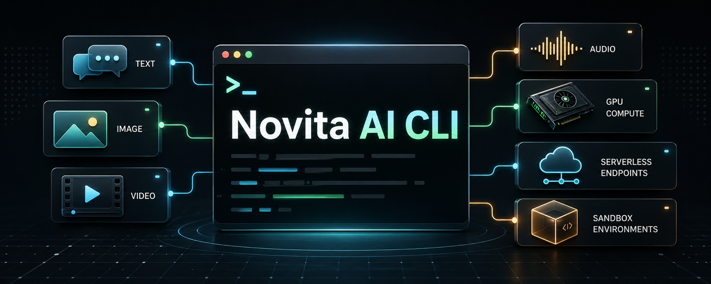

<p align="center">
  
</p>

<h1 align="center">novita-cli</h1>

<p align="center">
  The command-line interface for Novita AI. Generate text, images, video, audio, and launch GPU/serverless sandbox runtimes from any terminal or AI agent.
</p>

<p align="center">
  <a href="https://pypi.org/project/novita-cli/"></a>
  <a href="https://pypi.org/project/novita-cli/"></a>
  <a href="LICENSE"></a>
</p>

<p align="center">
  <a href="https://novita.ai">Novita AI</a> ·
  <a href="https://novita.ai/console">Console</a> ·
  <a href="https://novita.ai/docs/api-reference">API Docs</a>
</p>

`novita-cli` wraps major Novita AI APIs in a single `novita` command. It is built
for developers and AI agents that need fast access to model APIs, file workflows,
GPU instances, templates, network storage, serverless endpoints, and sandbox-style
container runtime environments.

## Features

- **Text** - Chat completions, text completions, embeddings, reranking, model lookup, streaming, and JSON output.
- **Image** - Text-to-image, FLUX generation, image-to-image, inpainting, upscaling, background tools, prompt extraction, and face merge.
- **Video** - Text-to-video, image-to-video, Hunyuan video, async task polling, and result downloads.
- **Audio** - Text-to-speech, GLM TTS, speech-to-text, and voice cloning.
- **Files and batch** - Upload JSONL files, create batch jobs, inspect task state, and download outputs.
- **GPU sandbox runtimes** - Discover products, launch containerized GPU/CPU instances, manage ports, templates, metrics, storage, and clusters.
- **Serverless endpoints** - Create, update, inspect, and delete runtime endpoints for containerized inference workloads.
- **Account tools** - Check balance, billing, usage-based billing, and fixed-term billing.

## Install

```bash
pip install novita-cli
```

For AI agents:

```bash
npx skills add novitalabs/novita-cli
```

## API Key

Create an API key in the [Novita Console](https://novita.ai/settings/key-management):

```bash
export NOVITA_API_KEY="sk_..."
```

You can also pass a key per command:

```bash
novita --api-key sk_... chat "Hello"
```

## Quick Start

```bash
novita chat "What is Novita AI?" -m deepseek/deepseek-v3-0324
novita image flux "a cinematic robot painter" -W 1024 -H 576
novita audio tts "Hello from Novita" --voice Calm_Woman -o hello.mp3
novita account balance
```

## Text

```bash
# Streaming chat
novita chat "Explain GPU inference in one paragraph" -m deepseek/deepseek-v3-0324

# Non-streaming JSON response
novita --json-output chat "Return a JSON object with three startup ideas" --no-stream

# System prompt and token control
novita chat "Write a concise launch checklist" \
  --system "You are a pragmatic engineering lead" \
  --max-tokens 300

# Embeddings and reranking
novita embed "agent sandbox runtime"
novita rerank "best runtime for agents" -d "GPU instance" -d "serverless endpoint"
```

## Image

```bash
# Fast image generation
novita image flux "a glassmorphism command-line dashboard" -W 1024 -H 1024

# Stable Diffusion text-to-image with more controls
novita image generate "a product photo of a tiny AI server" --steps 30 -W 768 -H 768

# Image editing utilities
novita image reimagine photo.jpg -o reimagined.png
novita image remove-bg photo.jpg -o transparent.png
novita image to-prompt photo.jpg

# Inpainting with a mask
novita image inpainting scene.png mask.png "replace the chair with a GPU workstation"
```

## Video

```bash
# Text-to-video
novita video generate "a developer opens a glowing cloud terminal" --frames 32

# Image-to-video
novita video from-image cover.png --model SVD-XT

# Submit async work and check it later
novita video generate "a robot typing in a terminal" --no-wait
novita task status <task_id>
novita task wait <task_id> -o ./outputs
```

## Audio

```bash
# Text-to-speech
novita audio tts "Ship it when the tests are green." --voice Calm_Woman -o ship-it.mp3

# GLM TTS
novita audio glm-tts "Welcome to the runtime console." -o welcome.wav

# Speech-to-text
novita audio asr meeting.wav

# Voice cloning
novita audio voice-clone https://example.com/sample.wav "This is a cloned voice sample."
```

## Files, Batch, And Tasks

```bash
# Upload a JSONL file for batch processing
novita files upload requests.jsonl

# Create and inspect a batch
novita batch create <file_id>
novita batch list
novita batch get <batch_id>

# Inspect async tasks
novita task status <task_id>
novita task wait <task_id> -o ./results
```

## GPU Sandbox Runtimes

Use GPU instances when you need a containerized runtime for experiments, model
workloads, agent tools, or sandbox-style compute.

```bash
# Discover available products and clusters
novita gpu products --gpu-num 1
novita gpu cpu-products
novita gpu clusters

# Launch a containerized GPU sandbox/runtime
novita gpu create \
  --product-id 4090.16c125g \
  --image pytorch/pytorch:latest \
  --gpu-num 1 \
  --ports 8888/http

# Manage the runtime
novita gpu list --status running
novita gpu get <instance_id>
novita gpu metrics <instance_id>
novita gpu stop <instance_id>
novita gpu delete <instance_id>
```

## Templates And Storage

```bash
# Browse and inspect runtime templates
novita template list --channel official
novita template get <template_id>

# Create a reusable template
novita template create --name my-runtime --image pytorch/pytorch:latest

# Manage network storage
novita storage list
novita storage create --cluster-id <cluster_id> --name data-volume --size 100
novita storage delete <storage_id>
```

## Serverless Endpoints

```bash
# List endpoints
novita serverless list

# Deploy a containerized endpoint
novita serverless create \
  --name my-endpoint \
  --image myimage:latest \
  --port 8080 \
  --product-id <product_id>

# Scale or update an endpoint
novita serverless update <endpoint_id> --max-workers 3
novita serverless get <endpoint_id>
novita serverless delete <endpoint_id>
```

## Account And Billing

```bash
novita account balance
novita account billing
novita account usage-billing
novita account fixed-billing
```

## JSON Output

Add `--json-output` for machine-readable output:

```bash
novita --json-output chat "Hello" --no-stream
novita --json-output models list
novita --json-output account balance
```

## Links

- [Novita AI](https://novita.ai)
- [Novita Console](https://novita.ai/console)
- [API Documentation](https://novita.ai/docs/api-reference)
- [Agent Sandbox Quick Start](https://novita.ai/docs/guides/sandbox-agent-runtime-quick-start)
- [Changelog](CHANGELOG.md)

## License

[MIT](LICENSE)
